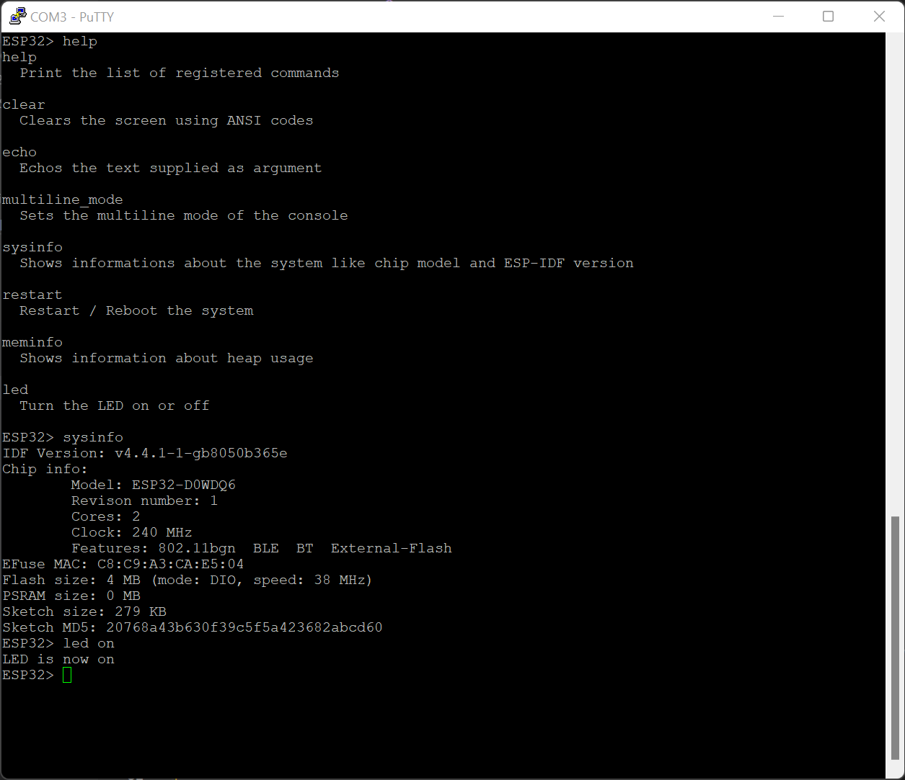

# ESP32Console

[](https://registry.platformio.org/libraries/jbtronics/ESP32Console)

Arduino library to add a serial console to your ESP32 console. It includes some useful commands and allows to easily add your own custom commands.

This easily allows you to control and configure your control via serial console in a comfortable and easy way.

This library encapsulates the Console component included in the ESP-IDF and allows to use it in an easy "Arduino-way".



## Features
* Simple to use
* Navigatable history, autocompletion with tab for commands (when using an ANSI terminal)
* Persistent history if wished (history gets saved across reboots)
* Many useful commands included like showing infos about system, memory, network and more (see [commands.md](commands.md) for more info)
* Console works in its own asynchronous task, so you can use your arduino loop() function as you like
* Support for environment variables and variable interpolation in commands
* Easy to implement own commands
* Easy to use argument parsing using cxxopts (see `argparser` example)
* Customizable prompt
* Ships a simple file editor to modify and create files locally on system if wanted


## Usage

### Installation
This library is available via Arduino Library Manager and [PlatformIO registry](https://registry.platformio.org/libraries/jbtronics/ESP32Console). So just install it via your preferred IDE's library manager and you are ready to start.

### Basic

To use this library you have to do an `#include <ESP32Console.h>` to import all needed files into your project. This library uses namespaces, so you have to do an `using namespace ESP32Console` to not having to prefix all classes (see example below).

You instantiate an `Console` object and initialize it with `Console.begin(BAUD)`. You can specifiy the baud rate and rx/tx pins similar to `Serial.begin`. Please note that you can use EITHER `Serial` OR `Console`. If you try to start ESP32Console after Serial was inited you will get an error.

Using `Console.registerCommand()` you can register your own custom commands. You have to pass a command object (see example below), which contains the name of the command, a little help text and the function which should be executed, when this command is executed. There are different types of commands:
* `ConsoleCommand`: The "default" console command, which takes a pointer to a function which is executed on call (similar to arduinos `attachInterrupt` function). The function receives an `int argc` which contains the number of arguments and `char** argv` which contains the arguments itself. The function MUST return an integer. Return 0 if everything was successfull, return something else (e.g. 1) if an error happened. This command type has the lowest memory usage.
* `ConsoleCommandD`: Similar to `ConsoleCommand` but allows to pass an `std::function` object as handler. This allows you to use lambda-functions and `std::bind`
* `OptionsConsoleCommand`: Allows you to define and parse command options and arguments in an easy way. Uses [cxxopts](https://github.com/jarro2783/cxxopts) for arguments parsing. Every command of this type has an `--help` and `--version` option. See `examples/argparser` for usage.

### Included commands
ESP32Console includes many useful commands, which can be registered using their respective `registerXXX()` functions. See [commands.md](commands.md) for a detailed list of the commands.

### Environment variables
The ESP32Console supports environment variables and string interpolation in the console. You can use `env` command to list all existing environment variables and `declare [VAR] [VALUE]` to change one. In the console prompt `$ENV` and `${ENV}` will get replaced by the value of the defined env value. With that you can for example define a variable with `declare HOST www.github.com` and access it in other commands: `ping $HOST`.
You can change and predefine env variables from your code. See `examples/gpio` for more info.

### Computer side
You can use almost any terminal software on PC for connecting with ESP32Console. You can use a simple terminal like the one included in Arduino but it is highly recommended to use a VT100 compatible terminal (e.g. PuTTY on windows).
This kind of terminal is needed for more complex functions like auto-complete with TAB, history scrolling, colors and more.

If you use a VT100 compatible terminal you can use the keybinds, when in prompt:
* `Ctrl + L`: Clear screen
* `Ctrl + A`: Jump cursor to begin of line
* `Ctrl + E`: Jump cursor to end of line
* `Ctrl + U`: Delete whole line
* `Ctrl + K`: Delete from current position to end of line
* `Ctrl + W`: Delete previous word
* `Ctrl + T`: Swap current character with previous one

## Examples
A simple usage can be seen here (see `examples/simple.ino`):
More advanced usages can be found in `examples/` folder.

```
#include <Arduino.h>

#include "ESP32Console.h"

using namespace ESP32Console;

Console console;

constexpr int LED = 2;

int led(int argc, char **argv)
{
    //Ensure that we have an argument to parse
    if (argc != 2)
    {
        printf("You have to give 'on' or 'off' as a argument (e.g. 'led on')\n");
        
        //Return EXIT_FAILURE if something did not worked.
        return EXIT_FAILURE;
    }
    
    //Take the first argument...
    auto arg = String(argv[1]);

    //and use it to decide what to do with the LED
    if (arg == "on") {
        digitalWrite(LED, HIGH);
        printf("LED is now on\n");
    } else if(arg == "off") {
        digitalWrite(LED, LOW);
        printf("LED is now off\n");
    } else {
        printf("Unknown argument!\n");
        return EXIT_FAILURE;
    }
    
    //Return EXIT_SUCCESS if everything worked as intended.
    return EXIT_SUCCESS;
}

void setup()
{
    pinMode(LED, OUTPUT);

    //You can change the console prompt before calling begin(). By default it is "ESP32>"
    console.setPrompt("MyConsole> ");

    //You can change the baud rate and pin numbers similar to Serial.begin() here.
    console.begin(115200);

    //Register builtin commands like 'reboot', 'sysinfo', or 'meminfo'
    console.registerSystemCommands();

    //Register our own command
    //First argument is the name with which the command can be executed, second argument is the function to execute and third one is the description shown in help command.
    console.registerCommand(ConsoleCommand("led", &led, "Turn the LED on or off"));

    //With ConsoleCommandD you can use lambda functions (and anything else that can be cast to std::function). This needs a bit more memory and CPU time than the normal ConsoleCommand.
    console.registerCommand(ConsoleCommandD("test", [](int argc, char **argv) -> int {
        printf("Lambda function test\n");
        return EXIT_SUCCESS;
    }, "Just a test command!"));

    //When console is in use, we can not use Serial.print but you can use printf to output text
    printf("\n\nWelcome to ESP32Console example. Try out typing 'led off' and 'led on' (without quotes) or see 'help' for all commands.");
}

void loop()
{
    //Console works async in its own task, so you can do whatever you want in your loop() function.
}
```

## Credits
* This library utilizes the console component of ESP-IDF written by Espressif at core.
* Argument parsing is done by [cxxopts](https://github.com/jarro2783/cxxopts).
* As editor a modified version of [kilo](https://github.com/antirez/kilo) is used.

## LICENSE
ESP32Console is licensed under MIT LICENSE. See [LICENSE file](LICENSE) for more info.

kilo shipped with ESP32Console is licensed under BSD-2 clause license. See the respective file for more info. 

## TODO
* Add more useful commands
* Easy integration of colors and console styles
* Support of command batch files
* Add support for ESP8266 (this should be possible in theory as the old RTOS-SDK already ships the console parts)
* Check if more complex terminal stuff, like pipes, output redirection and similar is possible (difficult due only having one global stdout)
